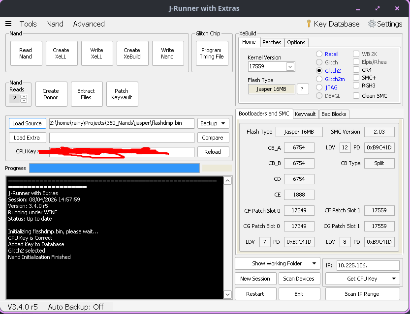

## Intro

hi! I'm Rainy, and I'm gonna talk a bit about hardware modding my Xbox 360. It was quite an endeavor and I learned a lot, so I'll get straight into it.

I won't talk too hard about the 360 itself, you likely have a general idea of what it is. It's a gaming console released by Microsoft in 2005, one of the best selling consoles ever, helped define the modern online gaming scene.. and it's my favorite console. I grew up with it, made too many memories on it, and it's a solid system overall.

This blog contains a proper-ish guide for RGH3 on a Tonasket console in the "Actually Doing The Mod" sections, following what I call the BadUpdate-assisted method.

## How can you mod a 360?

At a high level, modding an Xbox 360 (and most consoles) is typically done to allow the end user to run game backups without the disc in (games copied from disc to console storage), independent programs not approved by Microsoft (commonly called homebrew), and more.

These days, there's a few options for modding. You can do software only hacks with a USB stick using an exploit called [BadUpdate](https://github.com/grimdoomer/Xbox360BadUpdate), or its variations such as [ABadAvatar](https://github.com/shutterbug2000/ABadAvatar/releases). These are non-persistent so you have to run the exploit on each boot, and limit some functionalities, but are still close to hardware mods in terms of ability to run unsigned code and game backups (and games you totally own).

This blog will be focusing on hardware modding, specifically, a family of methods known as [RGH](https://consolemods.org/wiki/Xbox_360:RGH/RGH3), or Reset Glitch Hack. At a high level, RGH works by sending a precisely timed reset signal to the CPU, causing a power glitch, resulting in misbehavior like passing integrity checks when they'd normally fail. This allows the end user to run programs unapproved by Microsoft such as game backups, emulators, and other homebrew.

These days, the value of hardware mods has gone down somewhat in the face of newer developments, but they still have their own advantages like instant boot to hacked console. At this point in time, hardware mods are mostly for bragging rights and these smaller advantages.

## Actually Doing The Mod: Part 1

For this blog, I'll be documenting an RGH3 install on my Tonasket board as it reflects my recommended method of RGH installs in 2026. Later on I may expand this blog or write a sequel discussing the RGH1.2 install on my Falcon board.

RGH3 works by flashing a modified firmware to the System Management Controller (SMC) which is used to glitch the console. RGH1.2 uses an external glitch chip programmed with timing files, but we won't be discussing RGH1.2 much here. Again, maybe at a later point.

There are 2 main ways to go about RGH modding.

Firstly, I'll discuss what I call the "legacy" method, which goes as follows:

1. Tear the console down to the motherboard
1. Install RGH wiring
1. Set up NAND flasher to read NAND, then write back a modified one using [J-Runner](https://github.com/Octal450/J-Runner-with-Extras/releases)
1. Test the console
1. Reassemble

This works well, but there are some issues, mostly with the NAND flasher. While it's good to set one up anyway (you'll see what I mean in method 2), it takes a lot of extra soldering since the flashing chip must be wired to the motherboard, and if your wiring is bad you will read and write bad flashes, making troubleshooting more difficult. This is where method 2 comes into play.

We will call this the "BadUpdate-assisted method", which goes as follows:

1. Set up BadUpdate on a USB drive, and exploit the console that way
1. Run a software flasher like [Simple 360 NAND Flasher](https://consolemods.org/wiki/Xbox_360:Dumping_your_NAND_and_CPU_Key) to read console firmware
1. Plug the USB stick into a computer and build a modified NAND with J-Runner like normal
1. Write the modified NAND to an exploited console, "bricking" it
1. Open the console and install RGH wiring
1. Test console
1. Reassemble

The notable part of this setup is the removed need for a hardware flasher. However, please still have one handy in case this method goes awry.

## Actually Doing The Mod: Part 2

Now that I've explained at a high level how to complete RGH, I'll now get into the details of how I did RGH3 on my Tonasket board. I'll be partially adapting this guide from 15432's guide on RGH3 [here.](https://xbox360hub.com/guides/rgh-3-guide/) They are the primary developer of RGH3. Please check this guide for relevant supplies and pictures of the board.

Quick disclaimer: RGH3 is considered a "beta" modding method for Phat consoles. You may face unreliable boots, consoles that don't boot at all, and related behavior.

1. Set up BadUpdate. A good, in-depth video by MrMario2011 on how to do this is available [here.](https://www.youtube.com/watch?v=S4xyqbkK51w) MrMario is known for being very verbose and thorough in his videos, so if his style doesn't suit you, you can look elsewhere. If it's helpful, the main things you need to know to do is set up the exploit files, XexMenu (or another way to launch arbitrary xex files), and Simple 360 NAND Flasher. A quicker way of getting the files up and going is to use the [Xbox 360 Hack Pack](https://alex-free.github.io/360-hack-pack/#downloads) by alex-free, which simply involves extracting the files out to the USB drive. You will need a copy of Simple 360 NAND Flasher from the link in the previous section, because the one in the Hack Pack disallows NAND writes. Once you can successfully open 360 NAND Flasher on the console, you can move on to step 2.

1. Open NAND Flasher and read the NAND. This should produce a file called flashdmp.bin. Take the USB drive back over to your computer. If you haven't already, download J-Runner with Extras, linked in the previous section. Once you're able to open J-Runner on your PC, you can move to step 3.

1. Click the load source button on the left side of J-Runner. Select the flashdmp.bin file from the USB drive. The J-Runner window should now look like the picture below.
   

1. For RGH3, check the RGH3 box on the top right. 3 options will be presented: 10MHz, 27MHz, and OC. I recommend trying both 10 and 27MHz on your system to see which is more reliable. OC is generally less tested and I haven't tried it myself, so I cannot recommend it. You may also be interested in patches to apply, but this guide will not go over those in-depth. If you'd like to use non-360 controllers, you should enable the USBdSec patch. Patches like XL USB and XL HDD increase the possible size of drives connected to the console. Once you are happy, click XeBuild at the top to create a NAND image, and save it to the same directory where flashdmp.bin was saved. The new file will be called updflash.bin.

1. Bring the USB drive back over to the console, and exploit again if needed. Now, open the NAND Flasher program that allows writes (only relevant if you downloaded from the Hack Pack), and write the NAND. Note that this will "brick" your console until you install the RGH3 wiring or restore your system with a retail NAND.

1. Open the console. Ifixit has a good guide on how to do it [here.](https://www.ifixit.com/Teardown/Xbox+360+Teardown/1203) You will need to tear the console down to the bare motherboard to perform RGH3.

1. From here, you can perform the wiring procedure of RGH3 normally. 15432's guide has pictures of the points on the board and relevant supplies and directions. If you prefer a video guide, [there's this one.](https://www.youtube.com/watch?v=Gq1Svm-s-DM) I recommend testing all components used and checking solder joints with a gentle tug. Once you've reattached the heatsinks and such, your board should look something like this\!

1. The moment of truth: testing the console. Reattach the RF board and set the console upright, then attach the power cable and video cord. Power it on. You should see the ring-of-light animation play on the RF board, and then the boot animation should appear on the screen. If everything works, [you should see something like this.](https://www.reddit.com/r/360hacks/comments/1ub2hkc/another_rgh_in_the_bag/) It's recommended to boot the console several times so you're certain you are happy with boot reliability. Don't be scared to try the different timings (10 or 27 MHz) if boot reliability is unsatisfactory.

1. Reassemble the console by essentially following a teardown guide in reverse. Congratulations, you have a hard-modded Xbox 360!

## Troubleshooting

I'll rapid fire through a few different issues you may run into.

1. Green light on board, but no RoL animation/no boot animation. Check wiring and try re-flowing points. Test components and joints. See problem 3 for more info.
1. RROD. This can point to many things. Consult [this page](https://consolemods.org/wiki/Xbox_360:Error_Codes) for error codes to decide further action. If the code is power or hardware related, there is a chance you damaged the board at some point during teardown. :(
1. Inconsistent boots. As mentioned in the disclaimer, RGH3 is officially a beta modding method for phat systems. Test different timing configurations and maybe try readjusting wires, but you're likely to hit a point of diminishing returns and will have to settle with whatever you get, lest you decide to switch to RGH1.2.

## The console is modded! Now what?

MrMario has loads of tutorials for doing various things with a modded Xbox 360. He covers many things from running game backups, to setting up Aurora, to emulators, to many more subjects. If you would like to go online, you'll need a stealth server. [Proto](https://xbox360hub.com/xbox-live-stealth/) is 100% free and reliable. [Xbguard](https://xbguard.live/) is another option with a custom dashboard and more features like gold spoofing. If it is appealing, you can pay $15 for their premium lifetime service. Otherwise, Google is your friend. If you're looking to sail the seas, Reddit has many communities focusing on getting console ROMs.

## Conclusion

That should cover things for this blog-guide hybrid thing! If you would like to reach out about any of the info in the guide, please do! Contact info is on the site's homepage.
