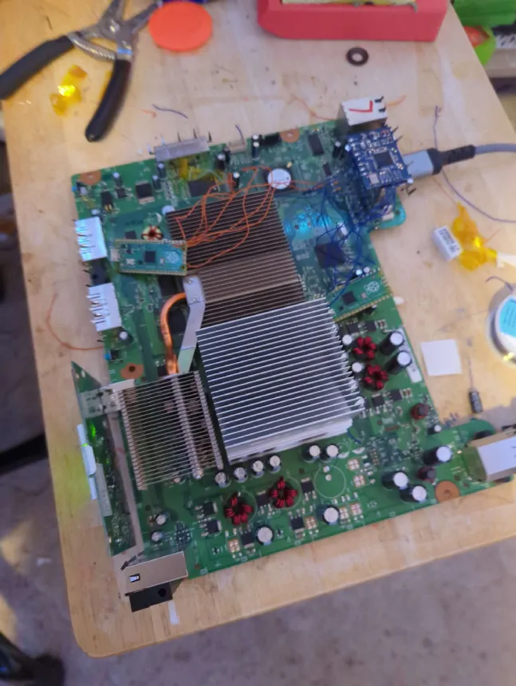

## Intro

This is a sequel blog of sorts to my 1st RGH blog. There, I discussed what RGH is at a high level and provided a guide for performing RGH3 on a Tonasket board without a NAND flasher. Here, I'll be discussing my experience in hard-modding a Falcon board Xbox 360, from an unsuccessful RGH3 install to reliable boots with RGH1.2.

This post should be relatively comprehensible even without the initial RGH blog, but I'd still recommend reading that first because I will not be going into many specifics on RGH in this post. The Additional Media section at the bottom will include resources to points of discussion in the blog.

## Getting the Xbox

Every story needs a beginning, and this one was pretty simple. A friend of mine from college collects many older consoles and related devices, and offered me this console for free. It's a July 2008 Falcon board Xbox 360 Pro. After a quick hiccup with the power supply, I got it up and working.

The first issue I ran into was parental controls, but thankfully, this is solvable quickly with BadUpdate. You can dump the NAND to find the reset code in J-Runner, as opposed to registering the system with Microsoft and getting the code that way.

I was initally hesitant on hard-modding the system; it would be my first phat modding and my second ever RGH console. However, I decided to go for it, and spent a weekend fulfilling the tasks explained in the rest of the post.

## Doing The Mod: RGH3 Attempt

The first thing I did was use BadUpdate to read and write the modified NAND. This would, unfortunately, prove to be a pretty useless endeavor later on, but if RGH3 had worked out normally, it would've been fine.

Opening up the Xbox 360 is a task in of itself. While it's far from impossible and gets easier once you get used to it, you need to be careful in some places, like opening the back and removing the x-clamps. However, once done, all that is left to do is prep the console for modding.

One small aspect I found funny was that this console had been both bolt modded and fan modded. Essentially, a bolt mod allegedly assists with greater contact between the CPU and GPU with their heatsinks by bolting the sinks to the board, and the fan mod increases the speed of the fans by increasing the voltage they receive with a resistor. This leads me to believe that this console had red-ringed at some point, and was brought to an independent repair shop for service.

RGH3 on phat systems is relatively easy to set up; prepare some wires, prepare the points, and get to soldering. Once the wires were on, I was able to test the system.

However, an issue arose quickly; the console powered on fine, but it did not play the RoL animation or boot animation. Attempted reboots did not work either. No matter what I tried, it was the same result. I eventually resorted to flashing the NAND with a hardware flasher, just to see if the issue lied there, but no dice. I got a total of 2 successful boots that I couldn't reproduce. One after switching the clock setting between 27 and 10MHz, and trying a 10kOhm resistor, which I now know is not recommended. Flashing the retail NAND worked fine and the console booted, meaning the issue was specifically with RGH3.

I felt pretty defeated after this. However, I really wanted to get this console hard-modded. I decided to order a Matrix V3 glitch chip and set up DirtyPico on a second Raspberry Pi. From there, I was able to start a RGH1.2 conversion.

## Doing The Mod: RGH1.2

Quick note: unlike my other blog, this won't really be any sort of guide, more so a retelling of experience. I won't be discussing anything particularly new or unique. If you'd like a proper RGH1.2 guide, there's plenty out there.

Once I had DirtyPico and the Matrix V3 chip in hand, I could get to work. The major difference between RGH3 and RGH1.2 is 1.2's usage of a glitch chip (the Matrix V3 in my case). This method requires flashing the glitch chip with timing files, and then soldering the glitch chip to the board. DirtyPico is a Raspberry Pi Pico firmware for programming devices via JTAG, which is how we program glitch chips.

Prepping and programming the glitch chip is relatively easy, it's a similar process to hardware flashing the 360. You hook up wires between the Pico and the glitch chip, start up J-Runner, and flash the chip with the timing files. Once that's done, I moved over to flashing with the NAND using another Pico and J-Runner for use with RGH1.2. Once that was done, I was able to get to wiring the glitch chip to the board. This went off without a hitch.. or so I thought.

Upon testing the system, I noticed a similar issue to what I faced with RGH3. Green light, but no boot animation. At first, I was worried the issue would persist no matter what modding method I used, and I had to settle for a retail console. However, upon doing more research, I learned I had done the glitch chip wiring wrong. I simply followed a video tutorial that had used a Coolrunner chip. When I rewired everything correctly, the console booted fine. At the end, the naked board looked something like this.

Needless to say, I was very pleased to see I had not only modded the console, but completed my first ever RGH1.2 install and my first RGH3 to RGH1.2 conversion. From here, I could remove the DirtyPico and PicoFlasher from the board and reassemble the system.

## Conclusion

I had quite a time putting together this hardware mod, and I learned a lot. I hope you've enjoyed reading through my endeavors.

## Additional Media

[RGH Info](https://consolemods.org/wiki/Xbox_360:RGH)

[RGH1.2 Video Tutorial](https://www.youtube.com/watch?v=3o0aPeCi18E)

[Matrix V3 Wiring Diagram](https://consolemods.org/wiki/Xbox_360:RGH/RGH1.2#Phat_Diagram_for_Matrix)

[Motherboard Info](https://consolemods.org/wiki/Xbox_360:Motherboard_Information)

[PicoFlasher](https://github.com/X360Tools/PicoFlasher/releases/)

[J-Runner (includes DirtyPico Support)](https://github.com/Octal450/J-Runner-with-Extras)

[DirtyPico Wiring Diagram](https://github.com/ThisIsCheez/J-Runner-with-Extras-DirtyPico360)
